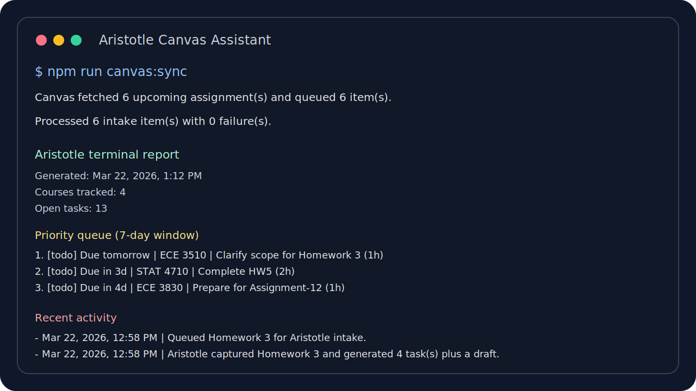

# Aristotle Canvas Assistant

Aristotle Canvas Assistant is a terminal-first Canvas copilot for students who already live in `Codex`, `Claude Code`, or a shell.

It pulls Canvas assignments, turns them into concrete tasks, keeps local state on your machine, and gives you fast plain-text outputs you can actually use while studying.



## Why this exists

Canvas shows deadlines. It usually does not tell you:

- what to do first
- how to break an assignment down
- what course is about to collide with another one
- what to review for a specific class right now

Aristotle is the narrower, more useful layer on top:

- sync real Canvas assignments
- break them into steps
- print a terminal report
- let you filter by course for targeted prep

## Product shape

This repo is intentionally not a dashboard app.

The main workflow is:

```text
Canvas
  ->
local sync
  ->
Aristotle task breakdown
  ->
terminal reports for updates, tasks, and course prep
```

That makes it fit well inside:

- `Codex`
- `Claude Code`
- a normal terminal session

## What it does today

- connect to Canvas with a personal access token
- preview upcoming assignments
- sync assignments into local state
- break assignments into actionable tasks and outlines
- print a plain-text updates report
- print a course-specific prep report
- keep all generated state on your machine

## Quick start

```bash
npm install
cp .env.example .env
```

Fill in:

- `CANVAS_BASE_URL`
- `CANVAS_ACCESS_TOKEN`

Then verify the connection:

```bash
npm run canvas:profile
npm run canvas:preview
```

## Core terminal workflow

```bash
npm run canvas:sync
npm run updates -- --days 7
npm run prep -- --course "ECE 3510"
npm run tasks
```

Example task update:

```bash
npm run task -- --id <task_id> --status done
```

## Main commands

- `npm run canvas:profile`: verify Canvas auth
- `npm run canvas:preview`: preview upcoming Canvas assignments
- `npm run canvas:sync`: fetch Canvas assignments and rebuild local Aristotle state
- `npm run updates -- --days 7`: print a plain-text report of what matters next
- `npm run prep -- --course "ECE 3510"`: print a course-specific attack order
- `npm run courses`: list tracked courses and workload counts
- `npm run tasks`: list active tasks
- `npm run task -- --id <task_id> --status in_progress`: update task status
- `npm run intake -- --interactive --sync`: add a manual assignment
- `npm run state`: print the saved local state
- `npm run demo`: seed a sample assignment and print the report

## Local-first behavior

- data is stored in `aristotle-data/` by default
- secrets stay in your local `.env`
- no hosted backend is required
- the repo includes GitHub Actions CI, but your actual assignment data stays local

Files written locally:

- `state.json`
- `latest-report.txt`

Override the default path with `ARISTOTLE_DATA_DIR` if you want.

## CLI v1 and extension v2

This repo is intentionally focused on the CLI first. The product direction is:

- `CLI v1`: terminal-first Canvas copilot
- `Chrome extension v2`: optional in-browser helper for Canvas pages

See [docs/product-spec.md](docs/product-spec.md).

## Testing

```bash
npm run check
npm run test
```

## Docs

- [Student Quickstart](docs/student-quickstart.md)
- [Product Spec](docs/product-spec.md)

## License

[MIT](LICENSE)
