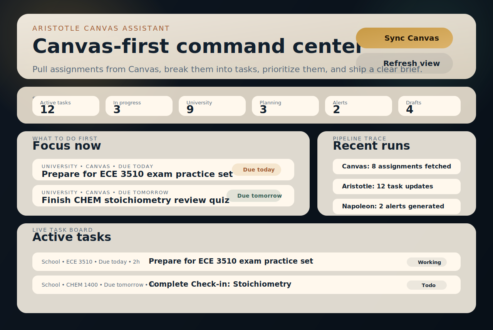

# Aristotle Canvas Assistant

Aristotle Canvas Assistant is a local Canvas-first study planner.

It pulls upcoming Canvas assignments, breaks them into smaller tasks, prioritizes the work, and gives you a brief plus a local dashboard you can actually use.



## Why this is useful

Canvas shows deadlines. It usually does not tell you:

- what to do first
- how to break an assignment down
- where workload collisions are forming
- what your next concrete step should be

This project adds a simple three-agent workflow:

- `Aristotle`: turns assignments into concrete tasks and prep checklists
- `Napoleon`: prioritizes what matters now and flags overload
- `Caesar`: produces the short command brief

## What it does

- connect to Canvas with a personal access token
- preview upcoming assignments
- sync assignments into local state
- break assignments into actionable tasks
- generate a brief, dashboard, and today view
- run a local web dashboard
- keep all generated state on your machine

## How it works

```text
Canvas
  ->
Canvas connector
  ->
Aristotle task breakdown
  ->
Napoleon prioritization
  ->
Caesar brief
  ->
Dashboard + today view + local state
```

## Quick start

```bash
npm install
cp .env.example .env
```

Add these values to `.env`:

- `CANVAS_BASE_URL`
- `CANVAS_ACCESS_TOKEN`

Then verify the connection:

```bash
npm run canvas:profile
npm run canvas:preview
```

## Main commands

```bash
npm run canvas:sync
npm run dashboard
npm run today
npm run web -- --sync
```

More commands:

- `npm run demo`: seed a sample assignment and generate a brief
- `npm run intake -- --interactive --sync`: add a manual assignment
- `npm run sync`: process inbox items and rebuild the brief
- `npm run tasks`: list active tasks
- `npm run task -- --id <task_id> --status done --sync`: update a task and refresh the brief
- `npm run daemon -- --interval 300`: resync Canvas every 5 minutes
- `npm run state`: print the saved local state

## Local-first behavior

- data is stored in `aristotle-data/` by default
- secrets stay in your local `.env`
- no hosted backend is required
- the repo includes GitHub Actions CI, but your assignment data stays local

Files written locally:

- `state.json`
- `latest-brief.txt`
- `latest-dashboard.txt`
- `latest-today.txt`

Override the default path with `ARISTOTLE_DATA_DIR` if you want.

## Demo mode

If you want to test the UI before connecting a real Canvas account:

```bash
npm run demo
npm run web
```

## Testing

```bash
npm run check
npm run test
```

## License

[MIT](LICENSE)

## Quick start doc

See [docs/student-quickstart.md](docs/student-quickstart.md) for the shortest path from Canvas token to running dashboard.
